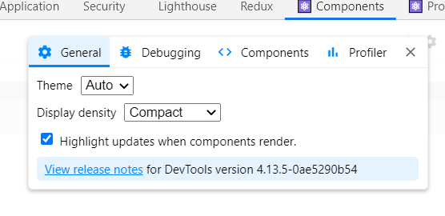
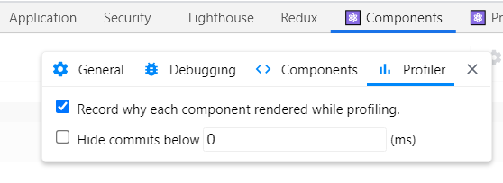
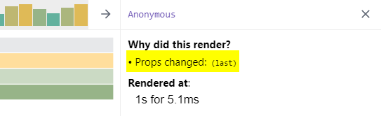

# Use React Dev tools to track why components have been rendered

The React DevTools chrome plugin has to methods to show why a component has re-rendered. The general tab has a setting which will 
highlight components as they are rendered

More useful is the ability to track why a component rendered in the profiler:

With this enabled React DevTools will record why the component rendered, whether this was a proop change or because the parent component re-rendered

